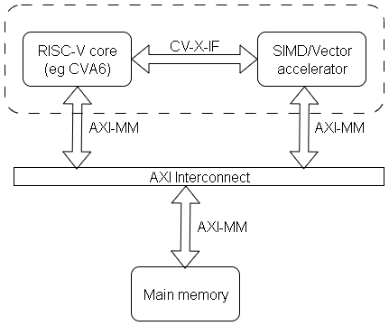

# Matrix Accelerator

This accelerator extending the RISC-V ISA for matrix operations. This accelerator is tingly-coupled with RISC-V core via [CV-X-IF](https://github.com/openhwgroup/core-v-xif). The interface to internal memory is AXI. The accelerator is implemented at RTL in System Verilog. And manage dependencies with [Bender](https://github.com/pulp-platform/bender). The accelerator incorporates a bi-dimensional memory, which is optimized for matrices accesses, the implemented memory allows access of multiple data in parallel. The bi-dimensional memory allows us to access multiple data on same row or same column. An important feature is software defined matrix registers; this improves flexibility for programmers. For matrix operations, we will use optimized hardware topology.



## Additional resources

1. [Modified GCC Compiler](https://github.com/alex2kameboss/MA-riscv-gnu-toolchain)
1. [Demonstrator](https://github.com/alex2kameboss/MatrixAcceleratorDemo)

## Software

1. [Bender](https://github.com/pulp-platform/bender)
1. QuestaSim
1. Vivado (tested on 2024.1)

## Demonstrators

For demonstration are available 3 options:
1. RTL simulation of the accelerator standalone
1. RTL simulation of the entire SOC (RISC-V core + accelerator + RAM)
1. Running the Vivado flow

### Accelerator standalone simulation
1. Run following commands to run the test

```tcl
make vsim
```

### SOC simulation

1. Clone demonstrator
```
git clone https://github.com/alex2kameboss/MatrixAcceleratorDemo
cd MatrixAcceleratorDemo
```

2. Build GCC
```
make gcc
```

3. Run QuestaSim RTL simulation
```
make sim
```

### Demonstrator Vivado flow fro VCU128

1. Clone demonstrator
```
git clone https://github.com/alex2kameboss/MatrixAcceleratorDemo
cd MatrixAcceleratorDemo
```

2. Run Vivado flow
```
make vivado
```

3. Write bitstream

In *runs* dir open Vivado project from the last created directory, the format is *run_dd-mm-yyyy-hhmmss*. The bitream is in that dir with the same name as project with extension *.bit*

## Project structure

- **src** - all project sorces
    - **rtl** - all synthetizable source code
    - **tests** - all test sources (non-synthetizable)
    - **includes** - *svh* files
    - **interfaces** - project interface definitions
    - **ips** - directory for all submodules, bender will download here all dependencies 
    - **packages** - project packages definitions
- **runs** - simulation running directory
- **scripts** - multiple script for various tools

## ISA

| **No.** | **Mnemonic** | **Op1 source** | **Op2 source** | **funct3** | **funct7** | **Description**                                                                   |
|---------|--------------|----------------|----------------|------------|------------|-----------------------------------------------------------------------------------|
| **1**   | v2ddef8      | Core           | Core           | 0          | 0          | Instructions to define int8_t matrix, width and height |
| **2**   | v2ddefu8     | Core           | Core           | 0          | 1          |Instructions to define uint8_t matrix, width and height|
| **3**   | v2ddef16     | Core           | Core           | 0          | 2          |Instructions to define int16_t matrix, width and height|
| **4**   | v2ddefu16    | Core           | Core           | 0          | 3          |Instructions to define uint16_t matrix, width and height|
| **5**   | v2ddef32     | Core           | Core           | 0          | 4          |Instructions to define int32_t matrix, width and height|
| **6**   | v2ddefu32    | Core           | Core           | 0          | 5          |Instructions to define uint32_t matrix, width and height|
| **7**   | v2dloc.rect  | Core           | Core           | 1          | 0          | Instructions to place the matrix in internal memory          |
| **8**   | v2dloc.row   | Core           | Core           | 1          | 1          |Instructions to place the matrix in internal memory|
| **9**   | v2dloc.col   | Core           | Core           | 1          | 2          |Instructions to place the matrix in internal memory|
| **10**  | v2dloc.trect | Core           | Core           | 1          | 5          |Instructions to place the matrix in internal memory|
| **11**  | v2dld        | Core           | -              | 2          | -          | Load matrix from main memory                                        |
| **12**  | v2dst        | Core           | -              | 3          | -          |Store matrix from main memory|
| **13**  | v2dadd.vv    | Accelerator    | Accelerator    | 4          | 1          | Matrix addition                                                                   |
| **14**  | v2dsub.vv    | Accelerator    | Accelerator    | 4          | 2          | Matrix subtraction                                                                |
| **16**  | v2ddiv.vv    | Accelerator    | Accelerator    | 4          | 8          | Element-by-element division                                                       |
| **17**  | v2dmul.vv    | Accelerator    | Accelerator    | 4          | 16         | Cross product                                                                     |
| **18**  | v2dsmul.vv   | Accelerator    | Accelerator    | 4          | 48         | Dot product                                                                       |
| **19**  | v2dadd.vs    | Accelerator    | Core           | 5          | 1          | Matrix scaling by addition                                                        |
| **20**  | v2dsub.vs    | Accelerator    | Core           | 5          | 2          | Matrix scaling by subtraction                                                     |
| **21**  | v2ddiv.vs    | Accelerator    | Core           | 5          | 8          | Matrix scaling by division                                                        |
| **22**  | v2dsll.vs    | Accelerator    | Core           | 5          | 9          | Matrix scaling by shift left logic                                                |
| **23**  | v2dsrl.vs    | Accelerator    | Core           | 5          | 10         | Matrix scaling by shift right logic                                               |
| **24**  | v2dsra.vs    | Accelerator    | Core           | 5          | 11         | Matrix scaling by shift right arithmetic                                          |
| **25**  | v2dmul.vs    | Accelerator    | Core           | 5          | 16         | Matrix scaling by multiplication                                                  |
